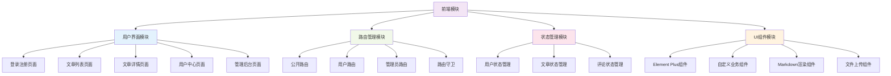
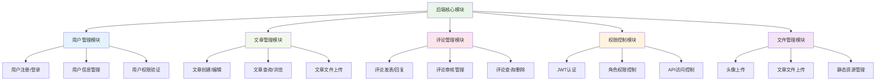
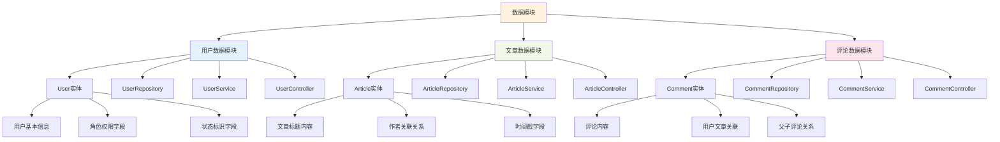
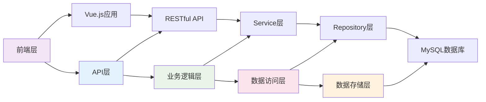
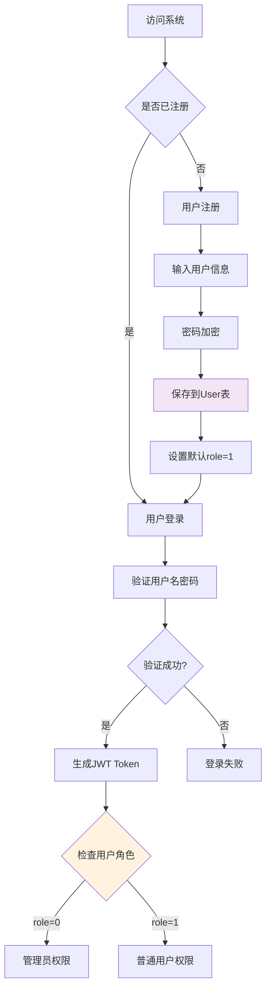
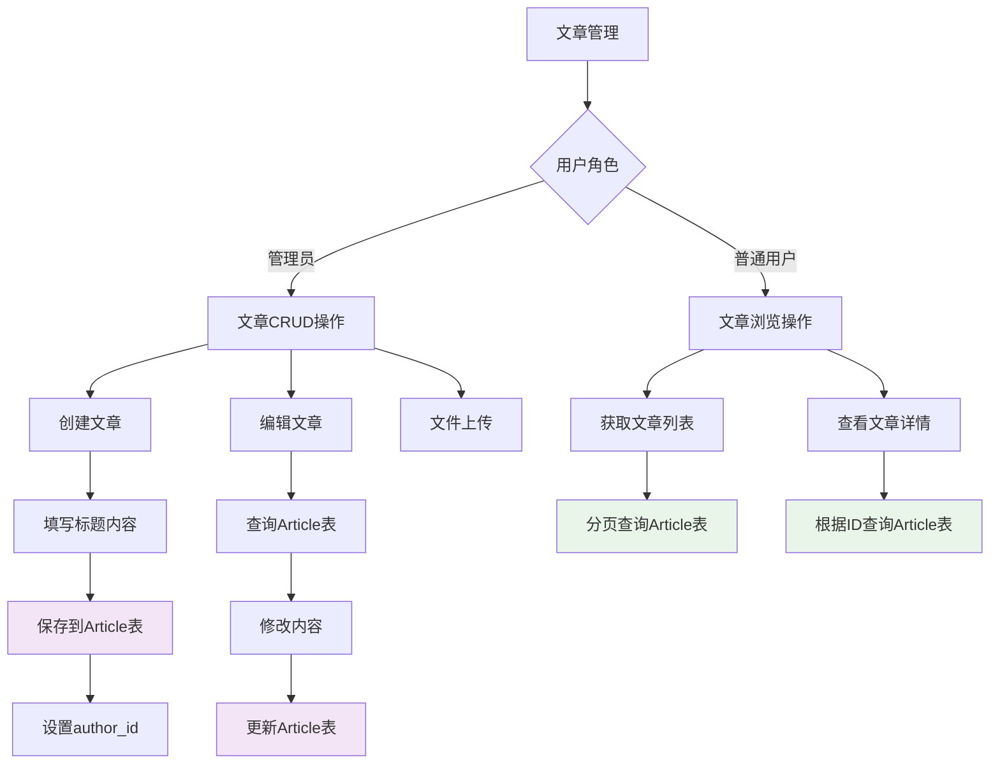
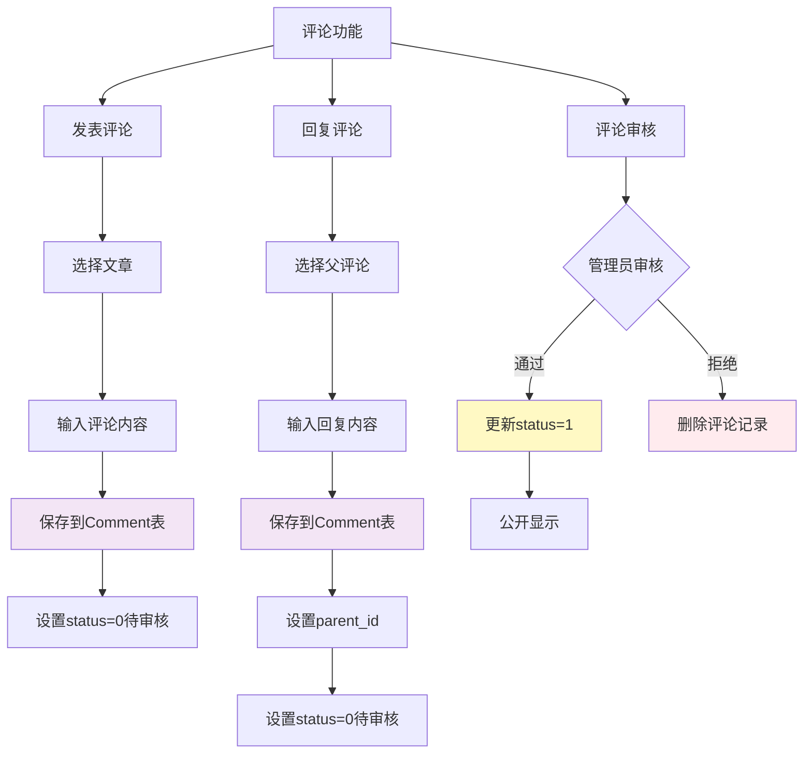
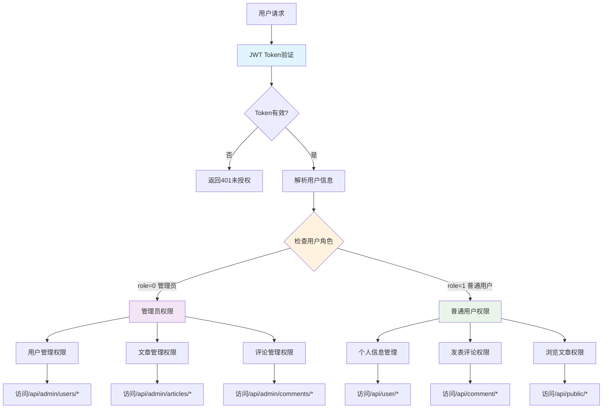
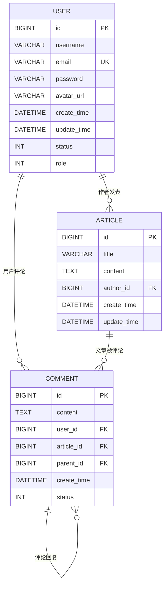

# 博客系统 - 综合设计项目

## 1. 项目概述

### 1.1 项目名称
**现代化博客内容管理系统（Modern Blog CMS）**

### 1.2 项目简介
本项目是一个功能完善的现代化博客系统，采用前后端分离的架构设计。前端使用Vue.js 3构建用户界面，后端基于Spring Boot框架提供RESTful API服务，数据库采用MySQL进行数据存储。系统实现了完整的博客功能，包括用户注册登录、文章发布与管理、评论系统、用户权限管理等核心功能。

该系统支持Markdown格式的文章编写，提供代码高亮显示，具备完善的用户权限控制机制，区分普通用户和管理员角色。管理员可以对用户、文章、评论进行全面管理，普通用户可以发表评论、管理个人信息。系统采用JWT认证机制保证安全性，支持文件上传功能，提供了现代化的响应式用户界面。整个系统设计遵循RESTful API规范，具有良好的可扩展性和维护性，适合作为个人博客、企业官网或内容管理平台使用。

## 2. 项目需求分析

### 2.1 功能性需求

#### 2.1.1 用户管理模块
- **用户注册**：支持邮箱注册，密码加密存储
- **用户登录**：基于JWT的身份认证机制
- **用户信息管理**：支持用户信息修改、头像上传
- **权限管理**：区分管理员（role=0）和普通用户（role=1）

#### 2.1.2 文章管理模块
- **文章浏览**：支持分页查询文章列表
- **文章详情**：查看单篇文章完整内容
- **文章创建**：管理员可通过表单或文件上传创建文章
- **文章编辑**：管理员可修改已发布文章
- **Markdown支持**：支持Markdown格式渲染

#### 2.1.3 评论系统模块
- **评论发表**：用户可对文章发表评论
- **评论回复**：支持二级评论回复功能
- **评论审核**：管理员可审核待发布评论
- **评论管理**：用户可管理自己的评论，管理员可管理所有评论

#### 2.1.4 管理员功能模块
- **用户管理**：查看所有用户，删除用户账户
- **内容管理**：管理所有文章和评论
- **系统监控**：查看系统运行状态

### 2.2 非功能性需求
- **安全性**：密码加密、JWT认证、CORS配置
- **性能**：数据库索引优化、分页查询
- **可用性**：响应式设计、友好的错误提示
- **可维护性**：模块化设计、代码规范

### 2.3 系统接口规范

#### 2.3.1 统一响应格式
```json
{
    "code": 200,
    "message": "success", 
    "data": {}
}
```

#### 2.3.2 主要API接口

**公共接口（无需认证）**
- `POST /api/public/register` - 用户注册
- `POST /api/public/login` - 用户登录  
- `GET /api/public/article` - 获取文章列表
- `GET /api/public/article/{id}` - 获取文章详情
- `GET /api/public/article/{id}/comments` - 获取文章评论

**用户接口（需要登录）**
- `PUT /api/user/info` - 更新用户信息
- `GET /api/user/getRole` - 获取用户权限
- `POST /api/user/upload` - 上传头像
- `GET /api/comment/` - 获取用户评论
- `DELETE /api/comment/{id}` - 删除评论

**管理员接口（需要管理员权限）**
- `GET /api/admin/users` - 获取所有用户
- `DELETE /api/admin/users/{id}` - 删除用户
- `POST /api/admin/articles` - 创建文章
- `POST /api/admin/articles/upload` - 文件上传创建文章
- `PUT /api/admin/article/{id}` - 更新文章
- `GET /api/admin/comments` - 获取所有评论
- `PUT /api/admin/comments/{id}` - 删除评论
- `GET /api/admin/comments/approve` - 获取待审核评论
- `PUT /api/admin/comments/approve/{id}` - 审核评论

## 3. 项目功能结构

### 3.1 系统架构

**前端层（Vue.js）**
- Vue Router - 路由管理
- Pinia - 状态管理  
- Element Plus - UI组件库
- Axios - HTTP客户端

**后端层（Spring Boot）**
- RESTful API - 接口服务
- JWT Security - 身份认证
- JPA/Hibernate - 数据访问层
- File Upload - 文件上传服务

**数据层（MySQL）**
- 用户表（users）
- 文章表（articles）
- 评论表（comments）

### 3.2 功能模块图

#### 3.2.1 系统功能模块结构

##### **前端模块结构**



##### **后端核心模块结构**



##### **数据模块结构**



##### **系统架构层次关系**



#### 3.2.2 核心功能模块详解

##### **用户管理模块（User Management）**

**功能职责**：
- 用户注册与登录认证
- 用户信息的增删改查
- 用户状态管理（正常/禁用）
- 用户角色管理（管理员/普通用户）

**主要接口**：
- `POST /api/public/register` - 用户注册
- `POST /api/public/login` - 用户登录
- `PUT /api/user/info` - 更新用户信息
- `GET /api/user/getRole` - 获取用户权限
- `GET /api/admin/users` - 获取所有用户（管理员）
- `DELETE /api/admin/users/{id}` - 删除用户（管理员）

**数据模型**：User实体，包含用户基本信息、角色权限、状态标识

##### **文章管理模块（Article Management）**

**功能职责**：
- 文章的创建、编辑、删除
- 文章列表的分页查询
- 文章详情的展示
- Markdown内容的处理
- 文章文件上传功能

**主要接口**：
- `GET /api/public/article` - 获取文章列表
- `GET /api/public/article/{id}` - 获取文章详情
- `POST /api/admin/articles` - 创建文章（管理员）
- `PUT /api/admin/article/{id}` - 更新文章（管理员）
- `POST /api/admin/articles/upload` - 文件上传创建文章（管理员）

**数据模型**：Article实体，包含标题、内容、作者、时间信息

##### **评论管理模块（Comment Management）**

**功能职责**：
- 评论的发表与回复
- 评论的审核机制
- 评论的查询与管理
- 二级评论支持
- 评论状态控制

**主要接口**：
- `GET /api/public/article/{id}/comments` - 获取文章评论
- `GET /api/comment/` - 获取用户评论
- `DELETE /api/comment/{id}` - 删除评论
- `GET /api/admin/comments` - 获取所有评论（管理员）
- `GET /api/admin/comments/approve` - 获取待审核评论（管理员）
- `PUT /api/admin/comments/approve/{id}` - 审核评论（管理员）

**数据模型**：Comment实体，支持自关联的父子评论结构

##### **权限控制模块（Permission Control）**

**功能职责**：
- JWT Token的生成与验证
- 用户身份认证
- 基于角色的访问控制（RBAC）
- API接口权限拦截
- 跨域资源共享（CORS）配置

**核心机制**：
- **JWT认证**：无状态的Token认证方式
- **角色控制**：管理员（role=0）vs 普通用户（role=1）
- **接口权限**：公开接口、用户接口、管理员接口三级权限
- **安全配置**：密码加密、Token过期、CORS限制

##### **文件管理模块（File Management）**

**功能职责**：
- 用户头像上传与存储
- 文章文件上传处理
- 静态资源访问控制
- 文件类型和大小限制
- 文件存储路径管理

**主要接口**：
- `POST /api/user/upload` - 上传头像
- `POST /api/admin/articles/upload` - 文章文件上传

**配置参数**：
- 文件大小限制：20MB
- 上传路径：`${user.home}/Pictures/Bolg_BackEnd`
- 访问路径：`/images/**`

#### 3.2.3 模块间交互关系

1. **用户管理 ↔ 权限控制**：用户登录后生成JWT，权限模块验证用户身份和角色
2. **文章管理 ↔ 用户管理**：文章与作者的关联，基于用户角色的操作权限
3. **评论管理 ↔ 用户管理**：评论与用户的关联，评论权限控制
4. **评论管理 ↔ 文章管理**：评论与文章的关联关系
5. **文件管理 ↔ 用户管理**：头像上传与用户信息更新
6. **文件管理 ↔ 文章管理**：文章文件上传与文章创建

所有模块都通过统一的RESTful API接口对外提供服务，采用JSON格式进行数据交换，并遵循统一的响应格式规范。

### 3.3 数据模型业务流程图

#### 3.3.1 用户注册登录流程



#### 3.3.2 文章管理流程



#### 3.3.3 评论管理流程



#### 3.3.4 权限控制流程



这些分模块的流程图清晰展示了User、Article、Comment三个核心模型在不同业务场景中的交互关系和数据流转过程。

### 3.4 技术栈

**前端技术栈**
- Vue.js 3.5.13 - 渐进式JavaScript框架
- Vue Router 4.5.1 - 路由管理
- Pinia 3.0.3 - 状态管理
- Element Plus 2.9.11 - UI组件库
- Axios 1.9.0 - HTTP客户端
- Marked 15.0.12 - Markdown解析
- Highlight.js 11.11.1 - 代码高亮
- Vite 6.2.4 - 构建工具

**后端技术栈**
- Spring Boot 3.5.0 - 应用框架
- Spring Security - 安全框架
- Spring Data JPA - 数据访问层
- MySQL 8.0 - 关系型数据库
- JWT (JJWT 0.12.6) - 身份认证
- SpringDoc OpenAPI 2.8.5 - API文档
- Lombok - 代码简化工具

## 4. 数据库设计

### 4.1 数据库表结构

#### 4.1.1 用户表 (users)
```sql
CREATE TABLE users (
    id BIGINT AUTO_INCREMENT PRIMARY KEY COMMENT '用户ID',
    username VARCHAR(50) NOT NULL COMMENT '用户名',
    email VARCHAR(100) NOT NULL UNIQUE COMMENT '邮箱',
    password VARCHAR(100) NOT NULL COMMENT '密码（加密）',
    avatar_url VARCHAR(255) COMMENT '头像URL',
    create_time DATETIME NOT NULL COMMENT '创建时间',
    update_time DATETIME COMMENT '更新时间',
    status INT NOT NULL DEFAULT 1 COMMENT '状态（0-禁用，1-正常）',
    role INT NOT NULL DEFAULT 1 COMMENT '角色（0-管理员，1-普通用户）'
);
```

#### 4.1.2 文章表 (articles)
```sql
CREATE TABLE articles (
    id BIGINT AUTO_INCREMENT PRIMARY KEY COMMENT '文章ID',
    title VARCHAR(200) NOT NULL COMMENT '文章标题',
    content TEXT NOT NULL COMMENT '文章内容（Markdown格式）',
    author_id BIGINT NOT NULL COMMENT '作者ID',
    create_time DATETIME NOT NULL COMMENT '创建时间',
    update_time DATETIME COMMENT '更新时间',
    FOREIGN KEY (author_id) REFERENCES users(id) ON DELETE CASCADE,
    INDEX idx_author_id (author_id),
    INDEX idx_create_time (create_time)
);
```

#### 4.1.3 评论表 (comments)
```sql
CREATE TABLE comments (
    id BIGINT AUTO_INCREMENT PRIMARY KEY COMMENT '评论ID',
    content TEXT NOT NULL COMMENT '评论内容',
    user_id BIGINT NOT NULL COMMENT '评论用户ID',
    article_id BIGINT NOT NULL COMMENT '文章ID',
    parent_id BIGINT COMMENT '父评论ID（二级评论）',
    create_time DATETIME NOT NULL COMMENT '创建时间',
    status INT NOT NULL DEFAULT 0 COMMENT '状态（0-待审核，1-已审核）',
    FOREIGN KEY (user_id) REFERENCES users(id) ON DELETE CASCADE,
    FOREIGN KEY (article_id) REFERENCES articles(id) ON DELETE CASCADE,
    FOREIGN KEY (parent_id) REFERENCES comments(id) ON DELETE CASCADE,
    INDEX idx_article_id (article_id),
    INDEX idx_user_id (user_id),
    INDEX idx_parent_id (parent_id),
    INDEX idx_status (status)
);
```

### 4.2 数据库关系

#### 4.2.1 实体关系图（ER图）



#### 4.2.2 关系详细说明

**1. 用户（User）与文章（Article）关系**
- **关系类型**：一对多（1:N）
- **外键**：`articles.author_id` → `users.id`
- **业务含义**：一个用户可以发表多篇文章，但每篇文章只能有一个作者
- **JPA注解**：
  - User: `@OneToMany(mappedBy = "author")`
  - Article: `@ManyToOne @JoinColumn(name = "author_id")`

**2. 用户（User）与评论（Comment）关系**
- **关系类型**：一对多（1:N）
- **外键**：`comments.user_id` → `users.id`
- **业务含义**：一个用户可以发表多条评论，但每条评论只能属于一个用户
- **JPA注解**：
  - User: `@OneToMany(mappedBy = "user")`
  - Comment: `@ManyToOne @JoinColumn(name = "user_id")`

**3. 文章（Article）与评论（Comment）关系**
- **关系类型**：一对多（1:N）
- **外键**：`comments.article_id` → `articles.id`
- **业务含义**：一篇文章可以有多条评论，但每条评论只能属于一篇文章
- **JPA注解**：
  - Article: `@OneToMany(mappedBy = "article")`
  - Comment: `@ManyToOne @JoinColumn(name = "article_id")`

**4. 评论（Comment）自关联关系**
- **关系类型**：一对多自关联（1:N Self-Reference）
- **外键**：`comments.parent_id` → `comments.id`
- **业务含义**：支持二级评论回复功能，一条评论可以有多个回复，但每个回复只能有一个父评论
- **JPA注解**：
  - Parent: `@OneToMany(mappedBy = "parent")`
  - Child: `@ManyToOne @JoinColumn(name = "parent_id")`

### 4.3 初始化数据SQL

系统提供了完整的测试数据SQL脚本(`test-data.sql`)，包含：
- 管理员账户：admin/admin@example.com（角色：管理员）
- 普通用户账户：张三、李四、王五等（角色：普通用户）
- 示例文章：Spring Boot教程、Vue.js开发实践等
- 示例评论：包含一级评论和二级回复

### 4.4 数据库配置

```yaml
spring:
  datasource:
    url: jdbc:mysql://localhost:3306/blog_db?useSSL=false&serverTimezone=UTC
    username: root
    password: root
    driver-class-name: com.mysql.cj.jdbc.Driver
  
  jpa:
    hibernate:
      ddl-auto: update
    show-sql: true
    properties:
      hibernate:
        dialect: org.hibernate.dialect.MySQL8Dialect
        format_sql: true
```

## 5. 项目部署与运行

### 5.1 环境要求
- JDK 21+
- Node.js 16+
- MySQL 8.0+
- Maven 3.6+

### 5.2 后端运行
```bash
# 创建数据库
mysql -u root -p
CREATE DATABASE blog_db;

# 导入测试数据
mysql -u root -p blog_db < test-data.sql

# 运行后端服务
mvn spring-boot:run
```

### 5.3 前端运行
```bash
cd front-end
npm install
npm run dev
```

### 5.4 访问地址
- 前端应用：http://localhost:5173
- 后端API：http://localhost:8080
- API文档：http://localhost:8080/swagger-ui.html

## 6. 项目特色

1. **现代化技术栈**：采用最新版本的Vue 3和Spring Boot 3
2. **完善的权限控制**：基于JWT的认证授权机制
3. **响应式设计**：支持PC和移动端访问
4. **Markdown支持**：原生支持Markdown文章编写和渲染
5. **代码高亮**：集成Highlight.js实现代码块语法高亮
6. **文件上传**：支持头像上传和文章文件上传
7. **评论系统**：支持二级评论和评论审核机制
8. **API文档**：集成SpringDoc自动生成API文档

该博客系统具有完整的功能体系和良好的代码结构，可作为学习和实际项目的参考实现。

## 7. 相关文档

- **[项目总结与分析文档](./SUMMARY.md)** - 详细的开发体会、困难解决、收获总结及项目局限性分析
- **[系统功能测试文档](./TESTING.md)** - 详细的功能测试用例和运行结果截图